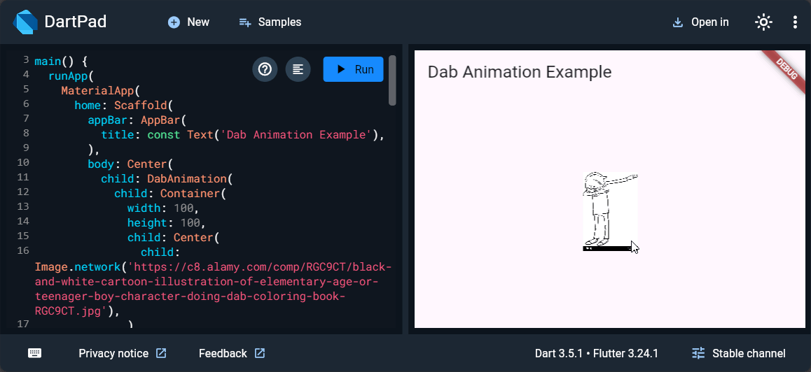

## W

w is a Flutter package that adds a fun dab animation to your widgets.

### Getting Started

1. Add the package to your `pubspec.yaml`:
```yaml
dependencies:
  w: ^1.0.0
```
2. Import the package:
```dart
import 'package:w/w.dart';
```

### Usage

To use this package, simply wrap any widget with `DabAnimation`:

```dart
import 'package:w/w.dart';

DabAnimation(
  child: YourWidget(),
)
```



### License

This project is licensed under the BSD (3-Clause) License - see the LICENSE file for details.

### Extra credits

[Woo](https://github.com/brainwo), who didn't claim this package name on pub before me, ripperoni in pepperoni.